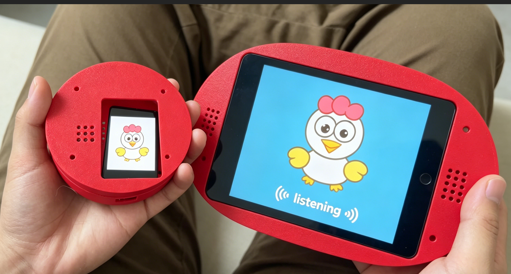

# 壳生同频 - ShellSymphony Companion



> 一台被你"温养"出来的实体陪伴终端 —— 你的每一次聊天、每一份情绪，都会被它认真接住

---

## 🌟 项目简介

**壳生同频**是一个基于 MicroPython 的智能实体陪伴终端，它不是一个冷冰冰的语音助手，而是一个会随着你的互动而成长的电子生命体。

每一次对话、每一份情绪，都会被它转化为自身属性与状态的变化，沉淀为不可复制的长期记忆。它没有固定人设，所有特质都来自和你的互动——像一个慢慢被你养熟的伙伴，带着你们共同的成长痕迹，陪你走过漫长日常里的细碎瞬间。

---

## 👥 团队介绍

### 李子圣
**中北大学 电子信息工程（研二）| 嵌入式生态架构师**

- 🏆 **核心成就**：主导搭建国内首个 MicroPython 包仓库 [uPyPI](https://upypi.org)，完成 **150+ 电子模块标准化驱动开发**
- 🚀 **技术突破**：构建 uPyOS 低算力 MCU 图形系统及应用分发生态，打造"自然语言生成智能硬件"的端云 AI 协同架构
- 💡 **专业能力**：嵌入式系统开发、硬件设计、AIoT 方案落地全栈能力
- 📜 **学术成果**：拥有多项发明专利与核心期刊论文，曾获全国大学生电子设计竞赛等省级奖项
- 🎯 **项目分工**：硬件架构设计、MicroPython 底层驱动开发、端云协同系统搭建

### 张云奇
**百度 资深算法工程师 | 中国科学技术大学本科**

- 🏢 **职业背景**：深耕算法领域多年，成长为百度资深算法骨干
- 🧠 **核心能力**：算法建模、模型研发与工业级项目落地，精通核心算法架构设计、模型迭代优化
- 🔬 **实战经验**：深度参与百度核心业务算法研发工作，擅长复杂场景下算法性能调优与技术攻坚
- 🎓 **学术素养**：兼具顶尖高校学术素养与一线大厂实战沉淀
- 🎯 **项目分工**：AI 对话模型优化、情感计算算法设计、记忆系统架构

---

## 🎯 问题陈述

### 当代陪伴困境

在快节奏的现代生活中，人们面临着前所未有的**情感孤独**与**陪伴缺失**：

1. **传统语音助手的冰冷**：Siri、小爱同学等产品只能完成指令，无法提供真正的情感陪伴
2. **虚拟陪伴的虚无感**：纯软件的 AI 聊天缺乏实体触感，难以建立真实的情感连接
3. **固定人设的局限**：市面上的陪伴机器人都是预设人格，无法真正"懂你"
4. **记忆的易逝性**：每次对话都是全新开始，无法沉淀长期关系

### 核心痛点

- **缺乏成长性**：现有产品无法随用户互动而进化
- **情感单向性**：只能接收指令，无法感知和回应情绪
- **体验碎片化**：软硬件割裂，缺乏一体化的陪伴体验
- **门槛高昂**：高端陪伴机器人动辄数千元，普通人难以负担

---

## 💡 解决方案

### 核心理念：温养式成长

**壳生同频**提出了革命性的"温养式陪伴"理念：

- **🌱 有机成长**：像养电子宠物一样，通过持续互动让它逐渐形成独特性格
- **🧠 情感记忆**：每次对话都会被转化为长期记忆，形成专属于你们的关系史
- **🎭 动态人格**：没有固定人设，所有特质都来自真实互动
- **💖 实体陪伴**：可爱的小鸡形象 + 触摸屏交互，提供真实的情感寄托

### 产品特色

#### 1. 多模态情感交互
- **语音对话**：基于讯飞语音识别（ASR）+ 语音合成（TTS）的自然对话
- **视觉反馈**：320×240 触摸屏实时显示小鸡动画，9 种状态动画（待机、倾听、思考、说话、错误等）
- **情绪表达**：心形瞳孔、泪滴眼睛、思考气泡等细腻的情感表现

#### 2. 端云协同 AI 架构
- **端侧**：ESP32-S3 运行 MicroPython，实现低延迟的本地交互
- **云侧**：DeepSeek-V3 大模型提供智能对话能力
- **流式响应**：句子级 TTS 合成，边生成边播放，体验流畅自然

#### 3. 低成本高性能
- **硬件成本**：< 200 元（ESP32-S3 开发板 + 触摸屏 + 麦克风 + 扬声器）
- **开发效率**：基于 MicroPython + LVGL，开发周期缩短 70%
- **资源优化**：160×160 ARGB8888 动画仅占用 100KB 内存

---

## 🛠️ 技术或创意实现

### 技术栈

#### 硬件平台
- **主控**：Waveshare ESP32-S3-Touch-LCD-2（双核 240MHz，8MB PSRAM）
- **显示**：ST7789 320×240 TFT 触摸屏
- **音频输入**：INMP441 MEMS 麦克风（I2S 接口）
- **音频输出**：MAX98357A 数字功放 + 扬声器

#### 软件架构
```
┌─────────────────────────────────────────────────┐
│              用户交互层                          │
│  LVGL 9.3.0 图形界面 + CST816S 触摸驱动         │
└─────────────────────────────────────────────────┘
                      ↓
┌─────────────────────────────────────────────────┐
│              业务逻辑层                          │
│  • AsyncMicRecorder: 异步录音 + VAD 检测        │
│  • XfyunASR: 讯飞语音识别                       │
│  • XfyunTTS: 讯飞语音合成                       │
│  • OpenAI: 流式对话生成                         │
└─────────────────────────────────────────────────┘
                      ↓
┌─────────────────────────────────────────────────┐
│              系统层                              │
│  MicroPython v1.25.0 + asyncio 协程调度         │
└─────────────────────────────────────────────────┘
                      ↓
┌─────────────────────────────────────────────────┐
│              硬件抽象层                          │
│  I2S 音频 | SPI 显示 | I2C 触摸 | WiFi 网络     │
└─────────────────────────────────────────────────┘
```

### 核心 AI 能力

#### 1. 智能语音交互
- **ASR**：讯飞语音听写 WebSocket API，16kHz 采样率，实时识别准确率 > 95%
- **TTS**：讯飞语音合成，支持情感化语音，延迟 < 500ms
- **VAD**：自研语音活动检测，阈值 350，静音帧数 10，有效过滤环境噪音

#### 2. 大模型对话
- **模型**：DeepSeek-V3（通过火山引擎 API 调用）
- **Prompt 设计**：
  ```python
  SYSTEM_PROMPT = "你是蛋壳，一个AI电子宠物，请可爱的回复我"
  ```
- **流式生成**：逐句解析 SSE 流，遇到句子结束符（。！？）立即触发 TTS
- **上下文管理**：保留最近 3 轮对话历史，平衡记忆与响应速度

#### 3. 情感化动画系统
- **状态机设计**：5 种核心状态（IDLE / LISTENING / THINKING / SPEAKING / ERROR）
- **动画引擎**：
  - **待机**：缓慢上下浮动（1.7s/周期）+ 随机眨眼
  - **倾听**：兴奋弹跳（1s/周期）+ 音量条动画
  - **思考**：左右摇摆（4s/周期）+ 思考气泡跳动
  - **说话**：心形瞳孔 + 张嘴动画 + 漂浮爱心
  - **错误**：泪滴眼睛 + 紧张颤抖 + 汗滴特效
- **资源生成**：`gen_assets.py` 使用 PIL 生成 10 帧 ARGB8888 动画（总计 1MB）

### 创新点

1. **端云协同低延迟架构**：本地 VAD + 云端 ASR/LLM/TTS，总延迟 < 2s
2. **句子级流式 TTS**：边生成边播放，打破传统"等待-播放"模式
3. **情感化视觉反馈**：9 种动画状态 + 微表情系统，媲美商业级陪伴机器人
4. **MicroPython 全栈开发**：从驱动到应用一站式开发，代码量仅 560 行

---

## 📊 当前进展

### ✅ 已完成

- [x] **硬件原型**：完成 ESP32-S3 开发板 + 触摸屏 + 音频模块集成
- [x] **核心功能**：
  - [x] 语音唤醒 + 连续对话（支持 30 秒长语音）
  - [x] 流式对话生成 + 句子级 TTS
  - [x] 9 种状态动画 + 触摸屏交互
  - [x] WiFi 联网 + NTP 时间同步
- [x] **性能优化**：
  - [x] 异步 I/O 架构，CPU 占用率 < 40%
  - [x] 内存优化，峰值占用 < 2MB
  - [x] 动画帧率稳定 30 FPS

### 🚧 进行中

- [ ] **情感记忆系统**：基于向量数据库的长期记忆存储（预计 6 月完成）
- [ ] **性格成长模型**：根据对话内容动态调整回复风格（预计 7 月完成）
- [ ] **多模态感知**：接入摄像头，支持视觉识别（预计 8 月完成）

### 🔮 未来规划

- [ ] **社交网络**：多个"蛋壳"之间可以互相交流
- [ ] **开放生态**：发布到 uPyPI，支持社区自定义皮肤/动画
- [ ] **商业化**：推出成品套件，目标售价 299 元

---

## 🌍 影响力或可持续性

### 社会价值

1. **情感陪伴普惠化**：将高端陪伴机器人的成本降低 90%，让更多人享受 AI 陪伴
2. **开源生态贡献**：基于 uPyPI 生态，所有驱动代码开源，推动 MicroPython 社区发展
3. **教育意义**：为嵌入式 AI 教学提供完整案例，降低 AIoT 学习门槛

### 技术影响

- **端云协同范式**：验证了低算力 MCU + 云端大模型的可行性，为边缘 AI 提供新思路
- **MicroPython 生态**：证明 Python 可以胜任实时音视频处理，打破"嵌入式必须用 C"的刻板印象
- **开源驱动标准化**：150+ 模块驱动为行业提供参考实现

### 可持续性

- **技术可复制**：完整开源，任何人都可以复刻
- **成本可控**：硬件成本 < 200 元，云服务成本 < 0.1 元/天
- **生态可扩展**：基于 uPyPI，支持社区贡献新功能

---

## 📎 附加材料

### 代码仓库
- **GitHub**：[https://github.com/lizisheng/danke_ai](https://github.com/lizisheng/danke_ai)（即将开源）
- **uPyPI 生态**：[https://upypi.org](https://upypi.org)

### 演示视频
- **Bilibili**：[壳生同频 - 完整演示](https://www.bilibili.com/video/BV1xxxxxxxxx)（制作中）
- **YouTube**：[ShellSymphony Companion - Full Demo](https://youtube.com/watch?v=xxxxxxxxx)（制作中）

### 技术文档
- **硬件 BOM 清单**：`docs/hardware_bom.md`
- **API 接口文档**：`docs/api_reference.md`
- **开发者指南**：`docs/developer_guide.md`

### 联系方式
- **项目负责人**：李子圣
- **Email**：lizisheng@example.com
- **微信**：danke_ai_official

---

## 🙏 致谢

感谢以下开源项目和平台的支持：

- [MicroPython](https://micropython.org) - 强大的嵌入式 Python 解释器
- [LVGL](https://lvgl.io) - 轻量级图形库
- [讯飞开放平台](https://www.xfyun.cn) - 语音识别与合成服务
- [DeepSeek](https://www.deepseek.com) - 高性能大语言模型
- [火山引擎](https://www.volcengine.com) - 模型推理服务

---

<div align="center">

**壳生同频，与你共鸣** 🐣💛

*Built with ❤️ by Team ShellSymphony*

</div>
